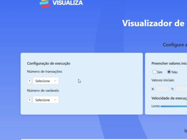
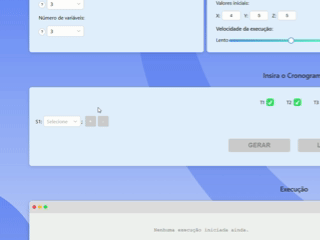
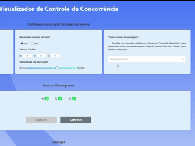
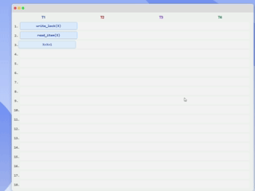
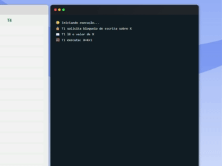

# Visualizador de Controle de Concorrencia

Aplicacao web interativa para visualizar passo a passo a execucao de transacoes concorrentes, compreender o uso de bloqueios e identificar situacoes como deadlocks e violacoes ao protocolo Two-Phase Locking (2PL).

## Como rodar na maquina

Antes de comecar, tenha o [Node.js](https://nodejs.org/) instalado na maquina.

1. Clone o repositorio:

```bash
git clone https://github.com/Kadu-Santos/controle-concorrencia-app.git
```

2. Acesse a pasta do projeto:

```bash
cd controle-concorrencia-app
```

3. Instale as dependencias:

```bash
npm install
```

4. Inicie a aplicacao:

```bash
npm start
```

5. Abra no navegador:

```text
http://localhost:3000
```

## Objetivo do projeto

Esta ferramenta foi criada para auxiliar no ensino e na pratica do controle de concorrencia em bancos de dados. Ela permite visualizar graficamente a execucao de transacoes concorrentes, compreender bloqueios compartilhados e exclusivos, alem de identificar automaticamente situacoes de deadlock e violacoes ao protocolo 2PL.

## Conceitos principais

**Controle de concorrencia:** quando varias transacoes acessam o banco de dados ao mesmo tempo, elas precisam fazer isso sem causar erros ou resultados inesperados. O controle de concorrencia garante que todas possam trabalhar simultaneamente de forma segura.

**Bloqueios:** antes de acessar um dado, uma transacao solicita um bloqueio para evitar conflitos. O bloqueio de leitura permite leituras simultaneas, enquanto o bloqueio de escrita garante exclusividade.

**Execucao concorrente:** operacoes de diferentes transacoes podem ser executadas de forma intercalada. Essa ordem, chamada de escalonamento ou cronograma, influencia diretamente a consistencia dos dados.

**Protocolo 2PL:** organiza o uso de bloqueios em duas fases. Na fase de crescimento, a transacao adquire bloqueios. Na fase de encolhimento, ela libera bloqueios e nao pode solicitar novos.

**Deadlock:** ocorre quando duas ou mais transacoes ficam esperando umas pelas outras para liberar bloqueios, criando um impasse.

## Como usar a ferramenta

### 1. Configure a execucao

Defina quantas transacoes deseja simular, quantas variaveis estarao disponiveis e a velocidade da execucao. Tambem e possivel informar valores iniciais para cada variavel.



### 2. Monte o cronograma

Crie a sequencia de operacoes de cada transacao. Adicione, remova ou edite livremente cada operacao para formar o escalonamento desejado.



### 3. Execute ou gere exemplos automaticos

Execute o escalonamento para visualizar sua execucao passo a passo ou gere exemplos automaticos com diferentes tipos de conflitos e comportamentos.



### 4. Acompanhe a simulacao

Veja a aplicacao de bloqueios, operacoes em espera, concessao de locks, deadlocks e o comportamento completo do cronograma ilustrado na tabela.



### 5. Analise o terminal

O terminal lateral explica cada etapa da execucao, indicando conflitos, regras do protocolo 2PL, deteccao de deadlock e justificativas de cada acao.



## Formato das operacoes

As operacoes seguem o formato:

```text
Transacao:Operacao:Variavel
```

Exemplos:

```text
T1:RL:X      // T1 solicita bloqueio de leitura em X
T1:WL:X      // T1 solicita bloqueio de escrita em X
T1:R:X       // T1 le X
T1:W:X       // T1 escreve em X
T1:X         // Atalho para escrita/expressao sobre X
T1:U:X       // T1 libera X
T1:Commit    // T1 confirma a transacao
```

Tambem e possivel trabalhar com expressoes, como:

```text
T1:X=X-10
T2:X=X+1
T3:X=X*2
```


## Responsaveis pelo projeto

- Carlos Eduardo dos Santos - Desenvolvedor
- Jefferson Silva Lopes - Professor orientador
